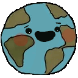

# Hier befinden sich die Bilder für das spiel SAVE THE PLANET
### in der datei wie-bilder-implementieren.md sind einige der vielen möglichkeiten aufgezeigt wie die bilder implementiert werden könnten.

